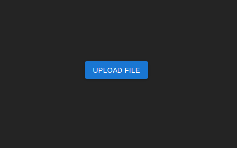
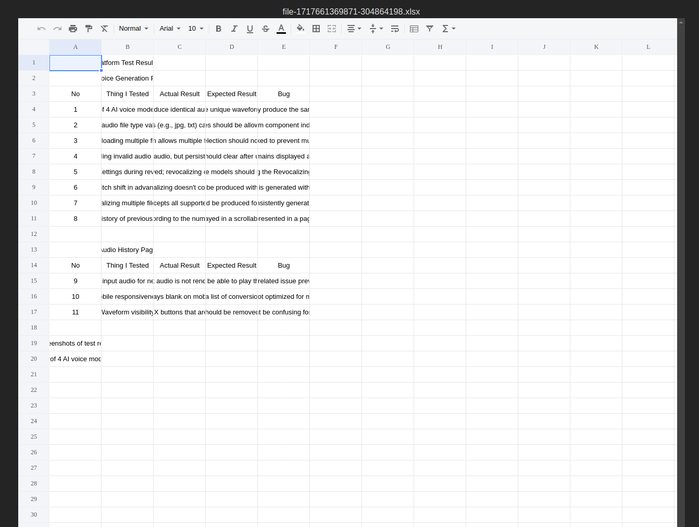

# Excel Viewer

## Prerequisities

- Docker and Docker Compose installed
- Node.js 18 installed (for development)
- pnpm (alternative to npm) installed (for development)

## Build and Start the Docker Containers:

```sh
$ docker-compose up --build
```

The backend service will be available on port 5000.
The frontend service will be available on port 3000.

## Running in Development Mode

- Backend

  - Install Dependencies:

    ```sh
    $ cd backend
    $ pnpm install
    ```

  - Start the Backend in Development mode:

        ```sh
        $ pnpm run start:dev
        ```

    The backend service will be available on port 5000.

- Frontend

  - Install Dependencies:

    ```sh
    $ cd frontend

    $ pnpm install
    ```

  - Start the Frontend in Development mode:

    ```sh
    $ pnpm run dev
    ```

  The frontend service will be available on port 5173.

## Brief Explanation of the Design Choices and the Libraries/Frameworks Chosen

- <strong>Backend (Nest.js) </strong>

  <b>Nest.js</b>: Chosen for its robust modular architecture and support for TypeScript, which allows for scalable and maintainable code. Its out-of-the-box support for decorators and dependency injection simplifies the development process.

  <b>Multer</b>: Used for handling file uploads. It provides an easy way to manage incoming files and store them on the server. The uploaded files are stored in the storage folder, and the backend returns a unique file name for each upload.

- <strong>Frontend (React.js with Vite) </strong>

  <b>React.js</b>: Selected for its component-based architecture, which enables the creation of reusable UI components and a dynamic user interface.

  <b>Vite</b>: Utilized as the build tool for its fast development server and optimized build process, which significantly improves development efficiency.

  <b>MUI (Material-UI)</b>: Employed for designing the UI. It provides a rich set of pre-designed components that ensure a consistent and visually appealing user interface.

  <b>excel-viewer</b>: This library is used to render Excel files from a URL. It simplifies the process of displaying Excel files in the frontend, allowing users to easily view the content.
  <a href="https://www.npmjs.com/package/excel-viewer">excel viewer </a>

## Preview

### Upload Page

<div align="center">

</div>

### Excel Viewer

<div align="center">

</div>
